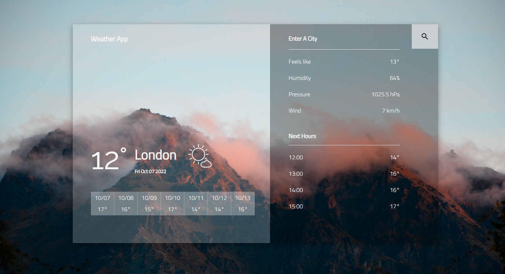

#  Wheather Aplication

A simple weather app build with ReactJS that allows you to get weather information, based on the city you enter. 

## Data fetched from: 

 - [**OpenCage Geocoding API**](https://opencagedata.com/) - converts city name to latitude/longitude.
      

 - [**Open-Meteo API**](https://open-meteo.com/en) - based on coordinates provides:
    * Current weather with temperature, windspeed and weather code;
    * Hourly weather with apparent temperature, pressure, humidity;
    * Weekly forecast.

 ## Visit live demo [here](https://weather-app-git-main-nat-laz.vercel.app/)
 ___

____
